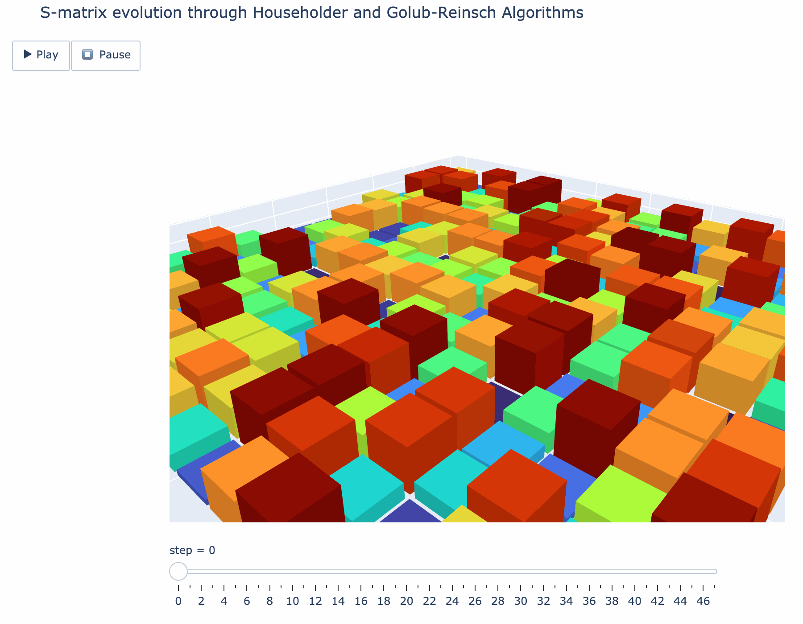

# cpca
### A C implementation of PCA packaged for python.

*This is a personal project to learn 4 things:*
1. Matrix operations and the CBLAS library in C and memory management in C.
2. Linear dimensionality reduction using PCA through different SVD algorithms.
3. How to package C code for python using cython. 
4. How to visualize matrix algorithms in python. 

### What is PCA?
Principle component analysis is linear non-parametric (assumes no distribution) transformation of data. It helps rotate the axes of the dataset in such a way that the axes express the data "better". In the real world we often don't know the dynamics and correlations of the systems we are measuring. So we choose variables, in a heuristic way. The goal of PCA is to minimize the redundancy of variables measured by covariance and maximize the signal measured by variance. This is what we mean by "better". We assume with this definition that the directions with the largest variences in our measurement vector space contain the dynamics of interest.

In other words we want to rotate our data matrix A to a set of basis vectors such that our goal is accomplished. For this we use the singular value decomposition (SVD) of a matrix with real elements. 

The output of PCA is: 
* Vectors specifying the principle components 
* The variance explained by the principle components in proportion to total variance of the dataset
* Loadings of principle components i.e. how much every variable contributes to a principle component.

For the PCA of 
```
double X[10][2] = {
    {2.5, 2.4},
    {0.5, 0.7},
    {2.2, 2.9},
    {1.9, 2.2},
    {3.1, 3.0},
    {2.3, 2.7},
    {2.0, 1.6},
    {1.0, 1.1},
    {1.5, 1.6},
    {1.1, 0.9}
};
```
we get as the results of PCA:
```
Importance of components:
                           PC1       PC2    
  Standard deviation       1.1331    0.2215
  Proportion Variance      0.9632    0.0368
  Cumulative Proportion    0.9632    1.0000

Rotation (loadings):
           PC1       PC2    
Var1      -0.7681    0.1629
Var2      -0.8331   -0.1502
```

### How can PCA be done with SVD?
Any real m * n matrix $`A`$ can be decomposed into $`A=U*\Sigma*V^T`$. Where $`U`$ (n*n) and $`V`$ (m*m) are orthogonal matrices and $`\Sigma`$ (n*m)is a diagonal matrix containing the singular values of $`A`$ (i.e. the eigenvalues of $`cov(A)`$). In other words any matrix can be decomposed into a rotation, a stretch and another rotation. 

For PCA $`A`$ must be centered with respect to the columns. 

The outputs of PCA can be computed from the SVD $`A`$: 
* Vectors specifying the principle components: $`V`$
* The variance explained by the principle components in proportion to total variance of the dataset: $`p_k = \sigma_k^2 / \Sigma_j \sigma_j^2`$
* Loadings: $`L = V · \Sigma / \sqrt(N−1)`$

SVD algorithm implemented: Golub Reinsch with Golub Kahan step [1] but there are many more to choose from. 

### What could be improved? 
* In the Golub Reinsch algorithm two operations could be parallelized. First the Givens rotations could be computed in parallel for more than one element since the rotations act on the i,i+1 rows/columns and don't touch the other ones. Second the individual subblocks could be identified in one loop and simultaniously be transformed using Givens rotations. This again because the rotations acting on one block will not affect the others by definition of the blocks and the rotation. Furthermore memory management could be improved by setting less copies and doing operations on A directly.
* Memory management inside the C functions.


### How is the C function packaged for Python?
To use the C function in python we wrap it using cython. For this we create the a general file structure (for a simple C function):
```
project/
├── src/
│   └── project/
│       ├── _c/           # all the raw .c & .h files
│       │   ├── func.c
│       │   ├── func.h
│       │   └── …         
│       ├── _func.pyx     # Cython wrapper
│       └── __init__.py   # makes `import cpca` work
├── python/
│   └── tests/            # tests
├── pyproject.toml        # modern build config
└── README.md | LICENSE | …
```

In this case, ```_cpca.pyx``` contains both the definitions of types and functions as well as the python wrapper for the C functions. One can also split the ```.pyx``` into a ```.pxd``` file containing the definitions separately. 

We use the declarative style ```pyproject.toml``` for the build instead of the ```setup.py```. Here we must specify the [build-system], [project] metadata, sources, dependancies, directories and other libraries to include. 

Finally this module can be build and install locally into the environment using ```pip install -e .``` (make sure you are in your virtual environment, or else your venv wont find the module).

Then we can run ```import cpca``` or ```pytest``` for the tests created in test_cpca.py. Every time the code changes we have to rebuild and install. 

### Visualization of the Golub-Reinsch algorithm
To visualize what is happening in the algorithm we reconstruct it in python and use plotly for visualizaiton. Then we use plotly to create a grid and plot the elements of the matrix on the grid as bar graphs. Each step in the alorithm that alters the matrix S is recorded. In the animation below we see how first the Householder algorithms rotates the basis vectors such that all non diagonal and superdiagonal elements are removed. Then the Golub-Reinsch algorithm starts performing transformations on the blocks. 

<p align="center">
  
</p>


### References
[1] Bernstein, D. S. (2007). Handbook of Linear Algebra. In Discrete Mathematics and its Applications. CRC Press. See especially Chapter 45 by Alan Kaylor Cline and Inderjit S. Dhillon.  
[2] StackExchange. (n.d.). Relationship between SVD and PCA: How to use SVD to perform PCA. Cross Validated. Retrieved from https://stats.stackexchange.com/questions/134282  
[3] Smith, K. W. (2015). Cython: A Guide for Python Programmers. O’Reilly Media.  
[4] Shlens, J. (2014). A Tutorial on Principal Component Analysis (Version 3). Retrieved from https://arxiv.org/abs/1404.1100  
